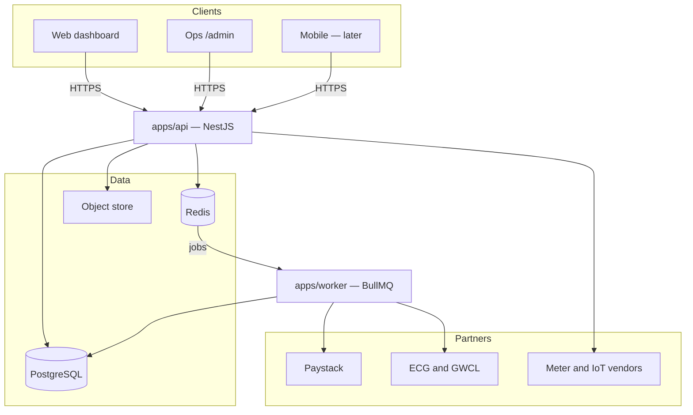
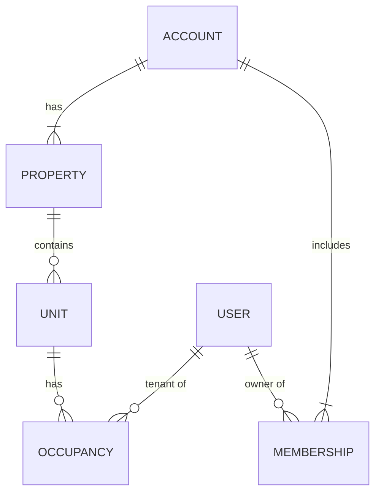
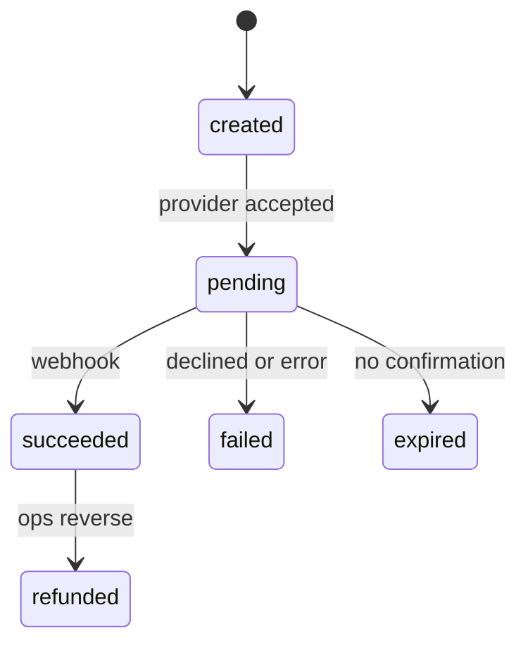
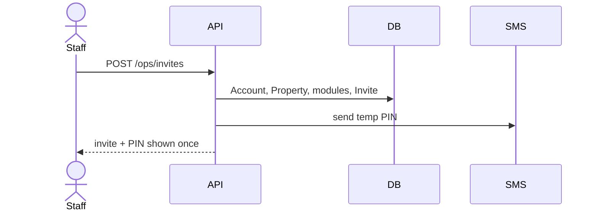
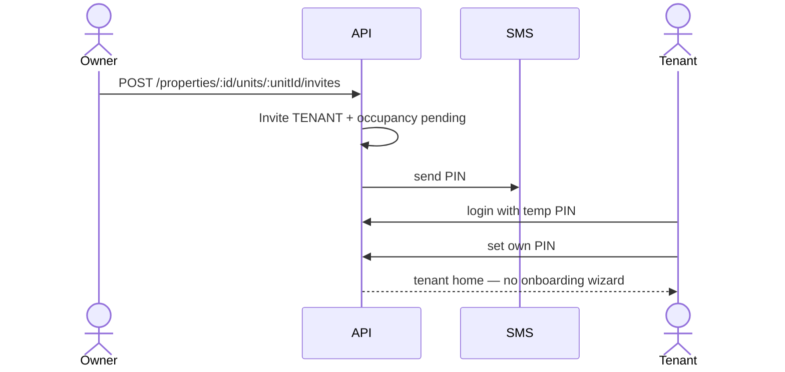
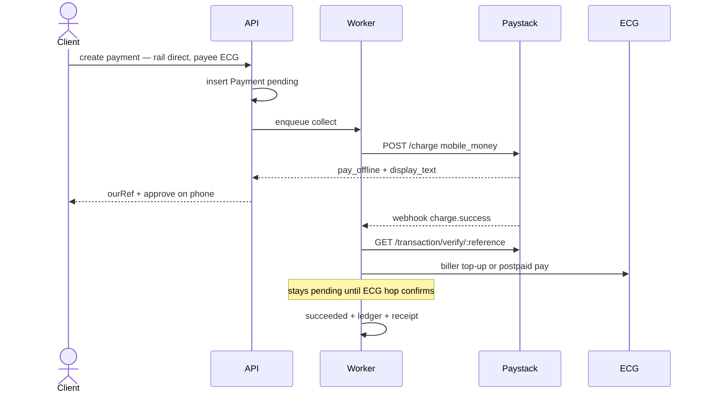
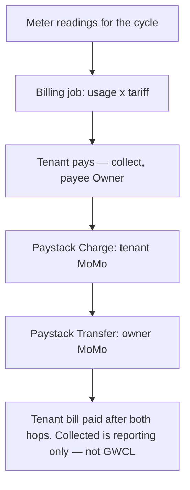
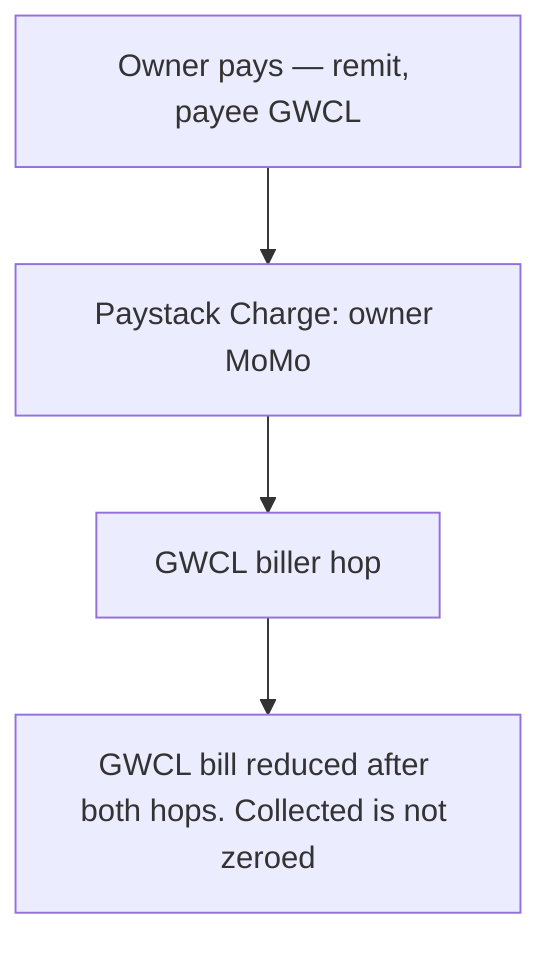
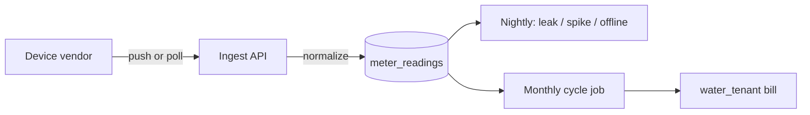
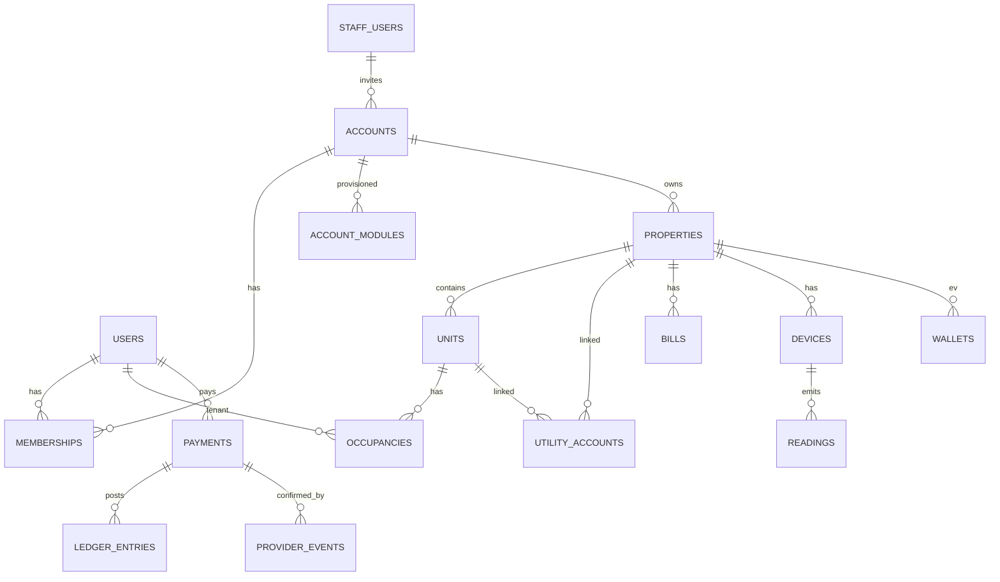

# IoTeedom Smart Pay — Technical PRD

**Status:** Draft for development  
**Date:** 24 August 2026  
**Audience:** Engineering, while building the real product  
**Product source of truth:** [PRD.md](./PRD.md)

This document turns the product PRD into a system you can implement. Product rules stay in `PRD.md`. If they conflict, product wins — then this file is updated.

The current `apps/web` app is a **client-side prototype** (Zustand, demo data, no backend). It is the UX and domain sketch. It is not the production architecture. We keep the dashboard and replace the store with a real API.

---

## 1. What we are building

One account. Many services. Superadmin decides which modules an owner can see. Tenants inherit those modules, further restricted. Payments are shared. Features are not.

v1 is a **web dashboard + API**. The EV mobile app is a later client of the same API. Do not design a second backend for it.

Ghana first: phone numbers, GHS, ECG, Ghana Water (GWCL), MTN MoMo / Telecel Cash / AT Money.

### Hard product rules that the system must enforce

1. ECG money never passes through the landlord. **Each party pays their own ECG** on their dashboard (tenant unit, owner house / common area). The owner must not pay a tenant’s ECG.
2. Water has two ledgers. Tenant → owner (collection). Owner → GWCL from the owner dashboard (remittance). They must not clear each other.
3. Modules are provisioned by superadmin on the **owner account**. Owners cannot self-serve a module on. Tenants cannot add modules.
4. We do not store MoMo PINs, card PANs, or payment secrets. We store provider references and our own ledger.
5. Amounts are integers in **pesewas**. Never floats for money.

---

## 2. Current prototype → production

| Prototype today                     | Production                                                                       |
| ----------------------------------- | -------------------------------------------------------------------------------- |
| `apps/web` Next.js, Zustand persist | Same dashboard, talks to `apps/api`                                              |
| `HouseState` blob per property      | Normalized Postgres tables                                                       |
| `accountModules` on the owner       | `account_modules` rows, enforced server-side                                     |
| `payBill` instantly succeeds        | Payment intent → provider → webhook → ledger                                     |
| Demo PIN on the client              | Argon2id hash, JWT session                                                       |
| Signup is open                      | Owner is invited. Tenant is invited by owner. Signup page becomes invite-accept. |
| IoT is fake toggles                 | Vendor ingest → normalizer → readings → alerts / bills                           |
| EV charge start/stop in the browser | Later: charger partner + mobile app against the same wallet                      |

Keep: routes, module catalog, rail language (`direct` / `collect` / `remit`), ops invite flow, receipts that name the payee.

Throw away: treating localStorage as the source of truth.

---

## 3. Target architecture



### Why this split

- The product PRD says the mobile app is a client of the same account. That requires a stable API, not Next.js route handlers that only the dashboard can call.
- MoMo webhooks, meter ingest, and monthly billing are background work. They do not belong in a page render.
- Ops and household share one API with different guards. Do not fork an “admin backend.”

### Monorepo

```
ioteedom-smart-pay/
  apps/web          # Next.js dashboard (existing)
  apps/api          # NestJS HTTP API
  apps/worker       # NestJS + BullMQ processors
  packages/db       # Prisma schema + generated client
  packages/shared   # module catalog, rails, money helpers, DTOs
```

v1 does **not** add `apps/mobile`. Keep EV tables so we do not migrate later.

### Stack (locked for v1 unless a decision below overrides it)

| Layer          | Choice                                                   | Why                                                                             |
| -------------- | -------------------------------------------------------- | ------------------------------------------------------------------------------- |
| Dashboard      | Next.js App Router (keep `apps/web`)                     | Prototype already lives here                                                    |
| API            | NestJS, feature modules                                  | Auth, payments, ingest, jobs; maps to product modules                           |
| DB             | PostgreSQL 16                                            | Relational money + property graph                                               |
| ORM            | Prisma                                                   | Schema as the contract; migrations in git                                       |
| Cache / queues | Redis + BullMQ                                           | Webhooks, retries, billing                                                      |
| Auth           | Phone + PIN, JWT access (15m) + refresh (30d, rotatable) | Matches Ghana UX in the prototype                                               |
| Money          | `bigint` pesewas, currency `GHS`                         | No float rounding                                                               |
| IDs            | ULID (text, sortable)                                    | Readable in support tools                                                       |
| Files          | S3-compatible (receipts PDFs)                            | Dashboard already has a print receipt route                                     |
| Payments       | **Paystack** (Ghana, GHS)                                | Charge API for MoMo in; Transfer API for owner payouts. Not an ECG/GWCL biller. |

---

## 4. Domain model

These are the nouns the whole system is built on. If a feature cannot be expressed with these, the model is wrong — do not add a parallel concept.

### 4.1 Identity

**User** — a person who can log in (phone unique). One user can be an owner of one account, a tenant of a unit, and later an EV driver. Role is **not** a column on `users`. Role is membership.

**Staff** — IoTeedom operators. Separate from household users. They live in `staff_users` and only use `/admin`. They never inherit owner modules.

**Account** — the commercial owner entity superadmin invites. Modules are provisioned **here**. Billing identity (“Kwame Boateng”, “Spintex Court Ltd”) lives here. An account is `HOME` or `ESTATE` as a default kind; actual shape is on properties.

**Invite** — pending access. Two kinds:

- `OWNER` — created by staff. Carries module set + first property.
- `TENANT` — created by an owner (or staff on their behalf). Carries unit.

### 4.2 Property graph



| Kind           | Shape                           | ECG                                                                                                                                                                                                                            | Water                                                                                                     |
| -------------- | ------------------------------- | ------------------------------------------------------------------------------------------------------------------------------------------------------------------------------------------------------------------------------ | --------------------------------------------------------------------------------------------------------- |
| Owner-occupier | Property `HOME`, no units       | Owner pays **their** ECG on the dashboard                                                                                                                                                                                      | Owner pays GWCL. No collection.                                                                           |
| Estate         | Property `ESTATE`, many units   | Each unit has a tenant ECG account the **tenant** pays. The property may also have an **owner ECG** account (common area, gate, owner’s house) that the **owner** pays. Owner sees tenant status only — never pays a unit ECG. | Each unit has a meter. Tenant pays owner. Owner remits GWCL on the property account from their dashboard. |
| Mixed          | Same owner, multiple properties | Per property / unit; always “pay your own meter”                                                                                                                                                                               | Per property / unit                                                                                       |

**Occupancy** is dated. A tenant leaving does not delete the unit or its meter history. It ends the occupancy. New tenant gets a new occupancy. Bills and payments stay attached to the occupancy that incurred them.

### 4.3 Modules

The catalog is **code**, not a table users can edit.

```
ecg | water | utilities | meters | smart_home | solar | ev
```

`account_modules` is the only place a module is switched on. UI, API, and jobs all check it. If `water` is off, you cannot generate tenant water bills. If `meters` is off, you still might have a GWCL remittance (owner-occupier with no IoT) — meters is the hardware module, water is the payment module. They are related but not the same flag.

Tenant visibility (server-enforced, matching the prototype):

| Module                  | Owner                                                             | Tenant                                    |
| ----------------------- | ----------------------------------------------------------------- | ----------------------------------------- |
| ECG                     | Pay **owner** ECG. Status on tenant units. Cannot pay a unit ECG. | Pay **own unit** ECG                      |
| Water                   | Collect from tenants, then remit GWCL from the dashboard          | Pay owner for own unit                    |
| Utilities               | Pay property-level waste / fibre                                  | No, unless we later attach a unit utility |
| Meters                  | All units                                                         | Own unit reading only                     |
| Smart home / solar / EV | Yes                                                               | No                                        |

### 4.4 Money

Every movement of GHS is a **Payment** with a **rail** and a **payee**.

| Rail      | Meaning        | Typical payee                                 | Clears                                                          |
| --------- | -------------- | --------------------------------------------- | --------------------------------------------------------------- |
| `direct`  | Payer → biller | ECG, Zoomlion, Telecel Home, EV wallet top-up | That biller / wallet                                            |
| `collect` | Tenant → owner | The owner account                             | The tenant’s water (or similar) bill. Does **not** settle GWCL. |
| `remit`   | Owner → GWCL   | Ghana Water                                   | The property GWCL bill. Does **not** mark tenants paid.         |

A payment has two identifiers:

- `our_ref` — `SP-……` shown on receipts. This is also the Paystack `reference` we send on Charge / Transfer (alphanumeric + hyphen is allowed).
- `provider_ref` — Paystack transaction id / transfer code (what support quotes to Paystack)

Status machine:



Never jump `created` → `succeeded` in the API process. Collection success is a Paystack webhook (or a verified poll). For ECG / GWCL, that is **not** enough — see §9. The prototype’s instant success is a lie we cannot ship.

### 4.5 Bills

A **Bill** is “this party owes this payee this amount for this cycle.” It is not a payment.

| Bill type      | Issued to                                       | Payee       | Source                         |
| -------------- | ----------------------------------------------- | ----------- | ------------------------------ |
| `ecg_postpaid` | Occupancy (tenant) or property (owner-occupier) | ECG         | ECG lookup or entered amount   |
| `ecg_prepaid`  | Same                                            | ECG         | User-chosen top-up. Not “due.” |
| `water_tenant` | Occupancy                                       | Owner       | Meter usage × property tariff  |
| `water_gwcl`   | Property (owner)                                | GWCL        | GWCL lookup or entered amount  |
| `utility`      | Property                                        | That biller | Biller or manual               |

Prepaid ECG is a top-up intent, stored as a bill with `amount_due = 0` and `topup_amount` chosen at pay time — or simply as a payment with no bill. Prefer **payment without a due-bill** for prepaid, so we do not fake a docket.

### 4.6 Devices

A **Device** belongs to a property, optionally a unit. Vendors are adapters.

Readings are append-only. Alerts are derived (spike, leak, offline) and can be dismissed or resolved without deleting the reading.

Water tenant bills are generated from meter readings. The meter module is how we know usage. The water module is how we collect it.

---

## 5. Roles and authorization

### 5.1 Principals

| Principal                    | Login                              | Scope                                                                                                 |
| ---------------------------- | ---------------------------------- | ----------------------------------------------------------------------------------------------------- |
| Staff (superadmin / support) | Staff phone + PIN (or later email) | All accounts. Invite owners. Toggle modules. Refunds. Cannot act as a household user.                 |
| Owner                        | Invited phone + PIN                | Own account’s properties, units, collections, remittances, devices (if provisioned). Invites tenants. |
| Tenant                       | Invited phone + PIN                | One occupancy: own ECG, own water bill, own meter.                                                    |
| EV driver (later)            | Same user record                   | Wallet + sessions. May or may not have a property.                                                    |

A user who is both owner and tenant uses **one login**. After auth, the API returns `memberships[]`. The dashboard already has a house switcher — that becomes account/property switcher driven by memberships.

### 5.2 Guards (API)

Every mutating endpoint checks, in order:

1. Authenticated.
2. Membership or staff.
3. Module enabled on the **owner account** (not the tenant).
4. Rail legality (tenant cannot call remittance; owner cannot pay a tenant’s ECG; owner **can** pay owner ECG).
5. Idempotency key on payments.

Staff impersonation is out of v1. Support reads; it does not “pay as user.”

---

## 6. End-to-end flows

### 6.1 Superadmin invites an owner



PIN is shown once in ops (as the prototype does) **and** sent to the owner. After first login the owner must set their own PIN. Store only the hash.

Owner first login:

1. `POST /auth/login` with invited phone + temp PIN.
2. Forced `POST /auth/pin` (replace PIN).
3. If `onboarded_at` is null → dashboard sends them to `/onboarding`.
4. Onboarding: confirm property address, link biller accounts for **enabled** modules only. Owner ECG number (theirs). GWCL number (theirs). Tenant ECG numbers are linked per unit when the tenant is invited or the unit is set up — not stolen from the owner’s house meter.
5. `POST /onboarding/complete` stamps `onboarded_at`. Modules remain read-only.

Owner cannot enable solar from this flow. If solar is off, the accounts step does not ask for an inverter.

### 6.2 Owner invites a tenant



The tenant does not pick modules. If the owner’s `ecg` is off, the tenant’s bills page has no ECG.

### 6.3 ECG pay (direct)

Whoever owns the meter pays it on their dashboard: tenant → unit ECG, owner → owner ECG, owner-occupier → house ECG. Same flow, different `utility_account`.



Paystack collects the money. It does **not** credit the meter. Payment stays `pending` until the ECG hop confirms. The receipt still says the payee is ECG, not IoTeedom or Paystack.

Landlord on an estate: **no** `POST /payments` against a **unit** ECG. They get `GET /units/:id/ecg-status` only. They **do** `POST /payments` against the **property** ECG (`utility_accounts.unit_id` is null) — their own bill.

### 6.4 Water collection (tenant → owner)

Triggered from the tenant dashboard, or from the owner’s unit list (“collect” is the same payment, initiated by either party, always `payer = tenant`).



Owner’s “to collect” is `sum(unpaid water_tenant bills)`. It is not `water_gwcl.due`.

### 6.5 Water remittance (owner → GWCL)



If tenants are late, the owner can still remit the full GWCL amount (covers the shortfall). If they collected more than GWCL (tariff spread), the extra stays with the owner — we do not invent a “hold back from Ghana Water” feature. Show both numbers. Do not net them in one KPI.

### 6.6 Owner-occupier water

No occupancy collection. `water_tenant` bills are not created. The only water bill is `water_gwcl`, rail `direct` (product language: they pay Ghana Water themselves). Use `direct`, not `remit`, so receipts and filters stay honest. `remit` means “this is the second hop of estate water.”

### 6.7 Meter → bill (phase 2, designed now)



If `meters` is on but the vendor is down, do not silently invent usage. Surface “no reading” and allow staff/owner to enter a **manual reading** with an audit row. Manual readings are first-class, tagged `source=manual`.

### 6.8 Module change after go-live

Staff `PATCH /ops/accounts/:id/modules`.

- Turning **off** hides UI and rejects new payments/jobs for that module. Historical payments remain visible in activity.
- Turning **on** does not invent biller numbers. Owner is prompted to link accounts next login (a banner, not a full re-onboard).
- Tenant access follows immediately.

### 6.9 Failed payment

Stay `failed`. Retry creates a **new** payment that points at the same bill (`retry_of_id`). Do not mutate the failed row into success. Receipts and ops search stay consistent.

---

## 7. Database design

PostgreSQL. Prisma in `packages/db`. All timestamps `timestamptz`. Soft-delete only where history matters (`users`, `properties`, `devices`); payments and readings are never deleted.

Money columns: `bigint` pesewas. Quantity: `numeric(14,4)` for m³ / kWh.

### 7.1 ER overview



### 7.2 Core tables

#### `users`

| Column          | Type        | Notes                               |
| --------------- | ----------- | ----------------------------------- |
| id              | text pk     | ULID                                |
| phone           | text unique | E.164 or local normalized to `233…` |
| phone_display   | text        | What we show                        |
| email           | text null   |                                     |
| name            | text        |                                     |
| pin_hash        | text        | Argon2id                            |
| must_change_pin | boolean     | true after invite                   |
| status          | enum        | `active` `suspended`                |
| last_seen_at    | timestamptz |                                     |
| created_at      | timestamptz |                                     |

#### `staff_users`

Same auth fields. `role`: `superadmin` | `support`. No memberships.

#### `accounts`

| Column              | Type             | Notes                          |
| ------------------- | ---------------- | ------------------------------ |
| id                  | text pk          |                                |
| name                | text             | Person or company              |
| kind                | enum             | `home` `estate`                |
| status              | enum             | `invited` `active` `suspended` |
| onboarded_at        | timestamptz null |                                |
| created_by_staff_id | text             |                                |
| created_at          | timestamptz      |                                |

#### `account_modules`

| Column          | Type                 | Notes       |
| --------------- | -------------------- | ----------- |
| account_id      | text                 |             |
| module          | enum                 | see catalog |
| enabled         | boolean              |             |
| set_by_staff_id | text                 |             |
| set_at          | timestamptz          |             |
| pk              | (account_id, module) |             |

#### `memberships`

| Column     | Type                  | Notes                               |
| ---------- | --------------------- | ----------------------------------- |
| id         | text pk               |                                     |
| user_id    | text                  |                                     |
| account_id | text                  |                                     |
| role       | enum                  | `owner` `manager` (manager = later) |
| unique     | (user_id, account_id) |                                     |

v1: one owner membership per invited user. `manager` reserved.

#### `properties`

| Column                      | Type        | Notes                             |
| --------------------------- | ----------- | --------------------------------- |
| id                          | text pk     |                                   |
| account_id                  | text        |                                   |
| label                       | text        | “East Legon”                      |
| address                     | text        |                                   |
| city                        | text        |                                   |
| kind                        | enum        | `home` `estate`                   |
| water_tariff_pesewas_per_m3 | bigint null | Required if `water` on and estate |
| status                      | enum        | `active` `archived`               |

#### `units`

| Column      | Type    | Notes    |
| ----------- | ------- | -------- |
| id          | text pk |          |
| property_id | text    |          |
| name        | text    | “Unit 2” |
| sort_order  | int     |          |

For `home` properties, zero units: ECG and GWCL hang on the property. For `estate` properties: tenant ECG hangs on the **unit**; owner ECG and GWCL hang on the **property** (`unit_id` null). An owner ECG and a unit ECG must never share a row.

#### `occupancies`

| Column         | Type                        | Notes                    |
| -------------- | --------------------------- | ------------------------ |
| id             | text pk                     |                          |
| unit_id        | text                        |                          |
| user_id        | text                        | tenant                   |
| started_at     | timestamptz                 |                          |
| ended_at       | timestamptz null            |                          |
| unique partial | one open occupancy per unit | `WHERE ended_at IS NULL` |

#### `invites`

| Column          | Type             | Notes            |
| --------------- | ---------------- | ---------------- |
| id              | text pk          |                  |
| kind            | enum             | `owner` `tenant` |
| account_id      | text             |                  |
| unit_id         | text null        | tenant only      |
| phone           | text             |                  |
| email           | text null        |                  |
| name            | text             |                  |
| pin_hash        | text             |                  |
| expires_at      | timestamptz      | 7 days           |
| accepted_at     | timestamptz null |                  |
| invited_by_type | enum             | `staff` `owner`  |
| invited_by_id   | text             |                  |

Owner invite also seeds `accounts` + first `properties` + `account_modules` before accept.

### 7.3 Billing and payments

#### `utility_accounts`

Biller numbers linked to a property or a unit.

| Column         | Type                            | Notes                                                    |
| -------------- | ------------------------------- | -------------------------------------------------------- |
| id             | text pk                         |                                                          |
| property_id    | text                            |                                                          |
| unit_id        | text null                       | set = tenant/unit ECG; null = owner ECG or property GWCL |
| service        | enum                            | `ecg` `water` `waste` `internet` …                       |
| biller         | text                            | `ECG` `GWCL` `ZOOMLION` `TELECEL_HOME`                   |
| account_number | text                            |                                                          |
| meter_number   | text null                       |                                                          |
| mode           | enum                            | `prepaid` `postpaid` `unknown`                           |
| unique         | (property_id, unit_id, service) |                                                          |

#### `tariffs`

Optional extra if a property needs stepped water tariffs later. v1 can stay on `properties.water_tariff_pesewas_per_m3`. Add this table when a client has slabs.

#### `bills`

| Column                  | Type         | Notes                          |
| ----------------------- | ------------ | ------------------------------ |
| id                      | text pk      |                                |
| type                    | enum         | see §4.5                       |
| rail                    | enum         | `direct` `collect` `remit`     |
| account_id              | text         | owner account                  |
| property_id             | text         |                                |
| unit_id                 | text null    |                                |
| occupancy_id            | text null    | tenant bills                   |
| utility_account_id      | text null    |                                |
| cycle                   | text         | `2026-07`                      |
| due_at                  | date null    |                                |
| amount_due_pesewas      | bigint       | remaining                      |
| amount_original_pesewas | bigint       |                                |
| payee_type              | enum         | `ecg` `gwcl` `owner` `utility` |
| payee_label             | text         | snapshot for receipts          |
| status                  | enum         | `open` `paid` `void`           |
| usage_m3                | numeric null | water_tenant                   |
| created_at              | timestamptz  |                                |

#### `payments`

| Column                  | Type        | Notes                                         |
| ----------------------- | ----------- | --------------------------------------------- |
| id                      | text pk     |                                               |
| our_ref                 | text unique | `SP-184201`                                   |
| bill_id                 | text null   | prepaid / wallet may be null                  |
| retry_of_id             | text null   |                                               |
| account_id              | text        | owner account in whose world this happened    |
| property_id             | text        |                                               |
| unit_id                 | text null   |                                               |
| occupancy_id            | text null   |                                               |
| payer_user_id           | text        |                                               |
| payee_type              | enum        | `ecg` `gwcl` `owner` `utility` `ev_wallet`    |
| payee_label             | text        | snapshot                                      |
| rail                    | enum        | `direct` `collect` `remit`                    |
| method                  | enum        | `mtn` `telecel` `at` `card`                   |
| amount_pesewas          | bigint      |                                               |
| status                  | enum        | see §4.4                                      |
| provider                | text        | always `paystack` in v1                       |
| provider_ref            | text null   | Paystack transaction `id` or `reference`      |
| transfer_code           | text null   | Paystack transfer (collect payout to owner)   |
| biller_ref              | text null   | ECG / GWCL fulfillment id                     |
| collection_status       | enum        | `none` `pending` `succeeded` `failed`         |
| fulfillment_status      | enum        | `not_required` `pending` `succeeded` `failed` |
| idempotency_key         | text unique | client-supplied                               |
| failure_code            | text null   |                                               |
| receipt_url             | text null   |                                               |
| created_at / updated_at | timestamptz |                                               |

Indexes: `(account_id, created_at desc)`, `(our_ref)`, `(provider_ref)`, `(bill_id)`, `(status)` where pending.

#### `ledger_entries` (append-only)

Double-entry enough to reconstruct balances without denormalized lies.

| Column         | Type        | Notes                                                                                       |
| -------------- | ----------- | ------------------------------------------------------------------------------------------- |
| id             | text pk     |                                                                                             |
| payment_id     | text        |                                                                                             |
| account_id     | text        |                                                                                             |
| property_id    | text        |                                                                                             |
| kind           | enum        | `ecg_out` `water_collect_in` `water_remit_out` `utility_out` `wallet_in` `wallet_out` `fee` |
| direction      | enum        | `debit` `credit`                                                                            |
| amount_pesewas | bigint      | always positive                                                                             |
| created_at     | timestamptz |                                                                                             |

**Balance rules**

- Owner water collected (reporting): sum of `water_collect_in` − nothing from remittance.
- Owner GWCL outstanding: from `bills` of type `water_gwcl`, not from collected.
- EV wallet: `wallet_in` − `wallet_out`.

Do not store `houses.waterCollected` as the only truth. Derive, cache on the property if needed (`cached_water_collected_pesewas`), recompute from ledger if drift.

#### `provider_events`

Raw webhook payloads. `payload jsonb`, `headers jsonb`, `processed_at`, unique `(provider, provider_event_id)`.

#### `payment_methods` (saved MoMo)

| Column                 | Type      | Notes                           |
| ---------------------- | --------- | ------------------------------- |
| user_id                | text      |                                 |
| network                | enum      | `mtn` `telecel` `at`            |
| msisdn                 | text      |                                 |
| paystack_customer_code | text null | if we create Paystack customers |
| is_default             | boolean   |                                 |

Never store the MoMo PIN. Paystack MoMo authorizations are not reusable for recurring charge — each pay is a new Charge.

A payment row is `succeeded` only when **every required hop** is succeeded. Collection via Paystack is never enough on its own for ECG or GWCL.

### 7.4 Devices, solar, EV (schema now, APIs later)

#### `devices`

| Column           | Type                       | Notes                                           |
| ---------------- | -------------------------- | ----------------------------------------------- |
| id               | text pk                    |                                                 |
| property_id      | text                       |                                                 |
| unit_id          | text null                  |                                                 |
| module           | enum                       | `meters` `smart_home` `solar`                   |
| vendor           | text                       |                                                 |
| vendor_device_id | text                       |                                                 |
| kind             | text                       | `water_meter` `lock` `inverter` `leak_sensor` … |
| name             | text                       |                                                 |
| location         | text null                  |                                                 |
| status           | enum                       | `online` `offline` `unknown`                    |
| last_seen_at     | timestamptz                |                                                 |
| unique           | (vendor, vendor_device_id) |                                                 |

#### `meter_readings`

| Column      | Type         | Notes                         |
| ----------- | ------------ | ----------------------------- |
| id          | bigserial    | time-series heavy             |
| device_id   | text         |                               |
| recorded_at | timestamptz  |                               |
| reading     | numeric      | cumulative m³                 |
| usage_delta | numeric null | if vendor sends interval      |
| source      | enum         | `vendor` `manual` `estimated` |
| raw         | jsonb        |                               |

Index `(device_id, recorded_at desc)`. Partition by month when volume warrants it. TimescaleDB is an option later, not a v1 requirement.

#### `device_events`

Smart-home and solar events (lock, AC setpoint, CO₂ peak). `at`, `device_id`, `type`, `payload jsonb`.

#### `alerts`

| Column                             | Type        | Notes                                                |
| ---------------------------------- | ----------- | ---------------------------------------------------- |
| id                                 | text pk     |                                                      |
| account_id / property_id / unit_id |             |                                                      |
| module                             | enum        |                                                      |
| tone                               | enum        | `warn` `info` `ok`                                   |
| code                               | text        | `leak_spike` `ecg_due` `gwcl_open` `charger_offline` |
| title / body                       | text        |                                                      |
| status                             | enum        | `open` `dismissed` `resolved`                        |
| created_at                         | timestamptz |                                                      |

#### EV (phase 3 tables, migrate in from day one empty)

- `vehicles` — user_id, plate, model
- `wallets` — account_id or user_id, balance_pesewas (cached + ledger)
- `charger_sites` / `chargers` — ops
- `charge_sessions` — site, kwh, amount, payment_id, status

### 7.5 Audit

`audit_log`: actor_type (`staff` `user` `system`), actor_id, action, account_id, target_type, target_id, diff jsonb, at.

Staff module changes, invites, refunds, manual readings, account suspend **must** write here. The prototype’s `opsActivityLog` is this table.

---

## 8. Module map (what each module actually is)

A module is: a flag, a set of API routes, a set of jobs, and a dashboard section. Adding a module later should mean a NestJS feature module + a Next.js route + `account_modules` — not a new product.

| Module                   | API                                        | Data                                  | Jobs                    | Dashboard                             |
| ------------------------ | ------------------------------------------ | ------------------------------------- | ----------------------- | ------------------------------------- |
| **Platform** (always on) | Auth, profile, activity, receipts          | users, accounts, properties, payments | webhook processor       | Overview, Activity, Profile           |
| **ECG**                  | Status, postpaid pay, prepaid top-up       | utility_accounts, bills, payments     | biller lookup, pay hop  | Bills (ECG card)                      |
| **Water**                | Tenant bill, collect, remit, GWCL due      | bills, tariffs, ledger                | cycle close (if meters) | Bills (water card), estate collection |
| **Utilities**            | Pay waste / fibre                          | utility_accounts, bills               | —                       | Bills extra rows                      |
| **Meters**               | Readings, request reading, alerts          | devices, meter_readings, alerts       | ingest, spike/leak      | `/meters`                             |
| **Smart home**           | Device list, commands, events              | devices, device_events                | command dispatch        | `/smart-home`                         |
| **Solar**                | Site, series, alerts                       | devices (inverter), readings          | production drop         | `/solar`                              |
| **EV**                   | Vehicle, wallet, history; later sessions   | vehicles, wallets, sessions           | charger ingest          | `/ev` + future app                    |
| **Ops**                  | Invites, modules, payments search, refunds | staff, audit                          | —                       | `/admin`                              |

Platform is not a toggle. Ops is staff-only.

ECG and Water both render on `/bills` because they are payments. They remain separate services in `account_modules`.

---

## 9. Payments with Paystack

**Locked.** All v1 collections go through Paystack Ghana, currency `GHS`, amounts in **pesewas** (Paystack subunits). Secret key never leaves `apps/api` / `apps/worker`. The dashboard only ever sees `our_ref`, status, and `display_text`.

Paystack is how money **leaves the customer’s MoMo**. It is not how money **arrives at ECG or GWCL**. Those are a second hop (`BillerAdapter`). Water collection to the owner _can_ complete on Paystack alone (Charge + Transfer).

Docs: [Charge](https://paystack.com/docs/api/charge/), [Payment channels — MoMo](https://paystack.com/docs/payments/payment-channels/), [Transfers](https://paystack.com/docs/transfers/single-transfers/), [Webhooks](https://paystack.com/docs/payments/webhooks/).

### 9.1 What Paystack does per rail

| Rail                           | Hop 1 — Paystack        | Hop 2                                  | `succeeded` when                                      |
| ------------------------------ | ----------------------- | -------------------------------------- | ----------------------------------------------------- |
| `direct` ECG / utility         | `POST /charge` (MoMo)   | Biller adapter pays ECG / Zoomlion / … | Charge verified **and** biller confirms               |
| `direct` GWCL (owner-occupier) | `POST /charge`          | Biller adapter pays GWCL               | Both                                                  |
| `collect` water                | `POST /charge` (tenant) | `POST /transfer` to owner MoMo         | Charge verified **and** `transfer.success`            |
| `remit` GWCL                   | `POST /charge` (owner)  | Biller adapter pays GWCL               | Both                                                  |
| `direct` EV wallet             | `POST /charge`          | Credit our `wallets` row               | Charge verified (`fulfillment_status = not_required`) |

Until a biller partner exists, ECG / GWCL payments may collect successfully and sit with `collection_status = succeeded`, `fulfillment_status = pending`. Ops sees them. The household receipt must **not** say “Paid to ECG” until hop 2 lands. Copy: “MoMo received. Waiting for ECG to credit the meter.”

### 9.2 Networks

| Dashboard    | Paystack `mobile_money.provider` | Transfer `bank_code` (typical) |
| ------------ | -------------------------------- | ------------------------------ |
| MTN MoMo     | `mtn`                            | `MTN`                          |
| Telecel Cash | `vod`                            | `VOD`                          |
| AT Money     | `atl`                            | `ATL`                          |

Charge requires `email`. Use the user’s email from invite. Do not invent a fake mailbox.

Phone on Charge: local Ghana format as Paystack expects (e.g. `0551234987`). Store E.164 on `users.phone`; convert at the adapter edge.

### 9.3 Charge (collection)

Worker calls Paystack, not the browser.

```
POST https://api.paystack.co/charge
Authorization: Bearer SK_…
{
  "email": "ama@…",
  "amount": "12750",
  "currency": "GHS",
  "reference": "SP-184201",
  "metadata": { "paymentId": "…", "rail": "collect", "payeeType": "owner" },
  "mobile_money": { "phone": "0244128891", "provider": "mtn" }
}
```

Expected `data.status`: `pay_offline`. Show `data.display_text` in the pay dialog (“Approve the prompt on your phone”). Customer has **180 seconds**. If no `charge.success` webhook, worker calls `GET /transaction/verify/:reference` and marks `failed` / `expired` from `data.message`.

Do not treat the Charge HTTP 200 as paid.

### 9.4 Transfer (owner payout on `collect`)

After tenant Charge verifies:

1. Ensure a Paystack transfer recipient (`type: mobile_money`, `account_number`: owner MSISDN, `bank_code`: telco). Store `recipient_code` on the owner’s settlement method.
2. `POST /transfer` with `source: balance`, `amount` in pesewas, `reference` derived from `our_ref` (e.g. `SP-184201-OUT`), `recipient`.
3. Listen for `transfer.success` / `transfer.failed` / `transfer.reversed`.

If Charge succeeded and Transfer failed, tenant is not yet “paid to owner”. Ops retry transfer. Do not auto-refund the tenant without a decision.

Enable Transfers on the Paystack dashboard (Ghana business). Test mode first.

### 9.5 Webhooks

`POST /webhooks/payments/paystack`

- Raw body HMAC-SHA512 with `PAYSTACK_SECRET_KEY`. Compare to `x-paystack-signature`. Reject if mismatch.
- Persist `provider_events` **before** side effects. Unique on Paystack event `id`.
- Return 200 quickly; enqueue the worker.
- After `charge.success`, **always** `GET /transaction/verify/:reference` and check `data.status === "success"` and `data.amount` equals `payments.amount_pesewas` and `data.currency === "GHS"` before crediting.
- Ignore unknown events.

Events we handle in v1: `charge.success`, `transfer.success`, `transfer.failed`, `transfer.reversed`, `refund.processed`.

### 9.6 Refunds

Ops `POST /ops/payments/:id/refund` → Paystack Refund API. Mark `refunded` only on `refund.processed` (or verify). If hop 2 already paid ECG, a Paystack refund does not un-credit the meter — ops needs a playbook, not a silent reverse.

### 9.7 Fees

Paystack MoMo Ghana is typically a percentage (confirm live pricing on the dashboard; historically ~1.95%, capped). Record `ledger_entries.kind = fee` from `data.fees` on the verified transaction.

**Open commercial:** who eats the fee — IoTeedom, the payer (gross-up), or the owner on collect. Default in code until the client says otherwise: **charge the bill amount, IoTeedom absorbs the fee.** Do not surprise the tenant with GH₵127.50 + fee unless product changes this.

### 9.8 Keys and environments

| Env             | Keys                              | Webhook             |
| --------------- | --------------------------------- | ------------------- |
| local / staging | Paystack **test** secret + public | ngrok / staging URL |
| prod            | **live** keys                     | prod API URL        |

`PAYSTACK_SECRET_KEY`, `PAYSTACK_PUBLIC_KEY` (public only if we later use Inline for cards). Test vs live objects never mix. `PAYMENTS_LIVE=false` still talks to Paystack test, not a fake adapter, once Phase 1b starts.

Cards: Paystack supports them. Out of v1 MoMo scope. Same `payments` row, `method = card`, later via Initialize Transaction + callback.

### 9.9 Adapter

One implementation: `PaystackAdapter implements ProviderAdapter`. No second aggregator in v1. Keep the interface so a biller or a future provider can sit beside it.

```ts
initiateCharge(input): Promise<{ reference: string; displayText: string }>
verifyTransaction(reference): Promise<VerifiedCharge>
initiateTransfer(input): Promise<{ transferCode: string }>
parseWebhook(rawBody, signature): ParsedEvent
```

---

## 10. API surface (v1)

Base: `https://api.…/v1`. JSON. Auth: `Authorization: Bearer <access>`. Staff: same, different guards.

Idempotency: header `Idempotency-Key` required on `POST /payments`.

### Auth

| Method | Path            | Who                                   |
| ------ | --------------- | ------------------------------------- |
| POST   | `/auth/login`   | public                                |
| POST   | `/auth/refresh` | public (refresh cookie or body)       |
| POST   | `/auth/logout`  | authed                                |
| POST   | `/auth/pin`     | authed, replace PIN                   |
| GET    | `/me`           | authed — user + memberships + modules |

No open `/auth/signup`. Invite-accept is login with temp PIN.

### Onboarding (owner)

| Method | Path                           |
| ------ | ------------------------------ |
| GET    | `/onboarding`                  |
| PATCH  | `/onboarding/property`         |
| PUT    | `/onboarding/utility-accounts` |
| POST   | `/onboarding/complete`         |

### Household

| Method | Path                                | Notes                                  |
| ------ | ----------------------------------- | -------------------------------------- |
| GET    | `/home`                             | due, last payment, alerts — role-aware |
| GET    | `/bills`                            | visible bills only                     |
| GET    | `/activity`                         | payments + device events mixed, cursor |
| GET    | `/properties`                       | owner’s houses                         |
| POST   | `/properties/:id/units/:id/invites` | owner invites tenant                   |
| GET    | `/units/:id`                        | owner                                  |
| GET    | `/meters`                           |                                        |
| GET    | `/meters/:id/readings`              | query from/to                          |
| POST   | `/meters/:id/manual-reading`        | owner / staff                          |
| GET    | `/devices`                          | smart home / solar gated               |
| POST   | `/devices/:id/commands`             | phase 2                                |
| GET    | `/ev`                               | phase 3 stub ok                        |

### Payments

| Method | Path                    |
| ------ | ----------------------- |
| POST   | `/payments`             |
| GET    | `/payments/:id`         |
| GET    | `/payments/:id/receipt` |
| POST   | `/payments/:id/retry`   |

`POST /payments` body:

```json
{
  "billId": "…",
  "amountPesewas": 12750,
  "method": "mtn",
  "msisdn": "23324…",
  "rail": "collect"
}
```

Server **ignores** client `rail` if it disagrees with the bill. Client sends it only so mismatches 400 instead of silently correcting.

Webhook: `POST /webhooks/payments/paystack` — unsigned or bad HMAC rejected.

### Ops

| Method | Path                        |
| ------ | --------------------------- |
| POST   | `/ops/invites`              |
| GET    | `/ops/accounts`             |
| GET    | `/ops/accounts/:id`         |
| PATCH  | `/ops/accounts/:id`         |
| PATCH  | `/ops/accounts/:id/modules` |
| POST   | `/ops/accounts/:id/suspend` |
| GET    | `/ops/payments`             |
| POST   | `/ops/payments/:id/refund`  |
| GET    | `/ops/audit`                |

### Device ingest (phase 2)

`POST /ingest/:vendor` — mTLS or vendor HMAC. Not a user JWT. Worker normalizes into `meter_readings` / `device_events`.

---

## 11. NestJS module layout

Feature modules, not technical layers. Each owns its controllers, services, and Prisma access for that slice.

```
apps/api/src/
  auth/
  users/
  accounts/          # accounts, memberships, modules
  properties/        # properties, units, occupancies, invites
  billing/           # bills, tariffs, cycle generation
  payments/          # intents, adapters, receipts
  ledger/
  devices/           # registry, commands
  ingest/            # vendor HTTP
  alerts/
  ops/
  ev/                # stub module, empty routes ok
```

Shared:

- `ModuleGuard` — loads `account_modules` for the active account.
- `RailGuard` — tenant × remittance = 403.
- Payment `ProviderAdapter` — v1 implementation is `PaystackAdapter` (§9). Biller fulfillment is a separate `BillerAdapter`.

Biller `BillerAdapter`:

```ts
lookup(accountNumber): Promise<{ duePesewas?: number; name?: string; mode: "prepaid" | "postpaid" }>
pay?(payment): Promise<void>  // after Paystack Charge; Paystack does not credit ECG/GWCL
```

v1 may ship adapters that only store the number and take an amount the user typed, if ECG/GWCL APIs are not actually available. The interface stays. Do not special-case “fake balance” in the dashboard.

---

## 12. Frontend (how `apps/web` should evolve)

1. Keep the route structure and visual system.
2. Replace Zustand persist with:

- TanStack Query (or similar) against `apps/api`
- cookie/session for refresh
- `RouteGate` driven by `/me` (role, onboarded, modules)

1. `useEnabled()` becomes modules from `/me`, not localStorage.
2. Pay dialog: show Paystack `display_text` + `pending` until hops complete (poll `GET /payments/:id`). Do not celebrate “paid to ECG” on Charge alone.
3. Receipts: server PDF in object storage; keep the print route as a viewer.

Do not rewrite the UI from scratch to “make it real.” Wire it.

---

## 13. Security, money, compliance

- PIN: Argon2id, 4–6 digits is the UX — compensate with rate limits (5 / 15 min / phone) and lockout. Add OTP reset in v1.1; v1 staff can issue a new invite PIN (audit logged).
- JWT access short-lived. Refresh rotatable, stored hashed.
- Webhooks: Paystack `x-paystack-signature` = HMAC-SHA512(raw body, secret). Persist raw event before processing. Processing is idempotent on Paystack event id. Always verify the transaction before ledger writes.
- Payments: unique `idempotency_key`. Unique `our_ref` (also the Paystack Charge `reference`). Ledger inserts in the same DB transaction as the hop that completes `succeeded`.
- PII: phone and meter numbers are personal. Encrypt at rest is a later hardening; v1 at least restrict ops search and do not log full payloads of webhooks that include MSISDNs at info level.
- Ghana Data Protection Act — we will need a lawful basis and a retention policy before go-live. Capture as a launch checklist, not as schema.
- We are not a bank. Wallet (EV) is a prepaid balance for charging, not a general deposit account. Do not allow arbitrary P2P.

---

## 14. Environments and config

| Env     | Web               | API                           | DB                        |
| ------- | ----------------- | ----------------------------- | ------------------------- |
| local   | `pnpm dev:web`    | `pnpm --filter api start:dev` | Docker Postgres + Redis   |
| staging | Vercel or similar | API host                      | managed Postgres          |
| prod    | same              | same                          | same, backups daily + WAL |

Secrets: `PAYSTACK_SECRET_KEY`, `PAYSTACK_PUBLIC_KEY`, JWT, SMS (Hubtel / Twilio / AT). Never in the Next.js client bundle.

Feature flags: `BILLER_ECG_LIVE`, `BILLER_GWCL_LIVE`, `PAYMENTS_LIVE` (Paystack **live** keys vs test keys). Staging uses Paystack test with the real UI.

---

## 15. Build order (follow this)

Each phase has a **done when**. Do not start the next phase’s UI until the previous **done when** is true, except schema work (EV tables can exist empty).

### Phase 0 — Platform skeleton (1–2 weeks)

- Monorepo: `apps/api`, `apps/worker`, `packages/db`, `packages/shared`
- Prisma schema for identity, accounts, modules, properties, units, occupancies, invites, audit
- Auth login / refresh / PIN
- Staff seed + owner invite + accept + onboarding persist
- Web: login and onboarding talk to API; modules from server

**Done when:** Superadmin invites an owner with ECG+Water only. Owner logs in, sets PIN, onboards. Dashboard hides solar/EV. Tenant cannot log in yet. Restarting the browser does not lose the account (it is in Postgres).

### Phase 1a — Bills without live billers (core v1)

- `utility_accounts`, `bills`, `payments`, `ledger_entries`
- `PaystackAdapter` pointed at **test** keys (or a recorded fixture if keys are not ready — still the Paystack shapes, not a generic fake)
- ECG direct (owner-occupier + tenant) — collection + pending fulfillment
- Water collect + remit with the two-ledger rule
- Estate: owner can pay **owner** ECG; owner cannot pay **unit** ECG
- Activity + receipt with payee name (honest copy if hop 2 is pending)
- Ops: payment search, failed vs pending vs success

**Done when:** On a seeded estate, a tenant pays water (collect) and ECG (direct). Owner still sees GWCL open. Owner remits GWCL. Three receipts, three payees. Ledger matches. Retry of a failed pay creates a new `our_ref`.

### Phase 1b — Paystack live test (MoMo)

- Charge + webhook signature + verify-before-credit
- MTN, Telecel (`vod`), AT (`atl`)
- Saved MSISDNs
- Collect rail: Transfer to owner MoMo after Charge
- Ops refund via Paystack Refund API
- 180s timeout → verify → `expired` / `failed`

**Done when:** A Paystack **test** MoMo from a test phone settles a wallet top-up (`fulfillment_status = not_required`) and the webhook is the only path to `succeeded`. A collect payment is not `succeeded` until `transfer.success`.

### Phase 1c — Real billers (as APIs exist)

- ECG adapter: lookup and/or pay **after** Paystack Charge
- GWCL adapter: lookup and/or pay **after** Paystack Charge
- If lookup does not exist, keep manual amount — do not fake a live balance in the UI

**Done when:** We can say honestly, per biller: “live balance” or “you type the amount,” and a direct ECG pay is `succeeded` only after both Paystack and the biller hop.

### Phase 1d — Tenants + thin ops polish

- Owner invites tenant to a unit
- Tenant home
- Account suspend
- Module toggle after invite

**Done when:** Product v1 success list in `PRD.md` is true on staging.

### Phase 2 — Meters, then smart home / solar

- Device registry + ingest HMAC
- Readings + alert jobs
- Billing job: readings → `water_tenant` bills
- Then vendor kits for smart home / solar using the same `devices` table

**Done when:** A meter reading change produces a tenant bill the next cycle without a developer writing SQL.

### Phase 3 — EV

- Wallet top-up (already a payment type)
- Sites / chargers ops
- Mobile app against `/v1`
- Do not start the app until Phase 1 payments are stable (product PRD)

---

## 16. Testing that actually protects the rails

Unit tests are not enough for water.

Must-have integration tests (API + Postgres):

1. Tenant collect does not reduce `water_gwcl.amount_due`.
2. Owner remit does not zero tenant `water_tenant` bills.
3. Estate owner POST ECG for a **unit** → 403.
4. Estate owner POST ECG for the **property** (owner meter) → 201/pending.
5. Tenant POST remit → 403.
6. Module off → 403 on that module’s routes; old payments still GET.
7. Duplicate Paystack webhook does not double-credit ledger.
8. Duplicate `Idempotency-Key` returns the original payment.
9. Home property has no `water_tenant` bills; water pay is `direct` to GWCL.
10. `charge.success` with mismatched `amount` or `currency` does not mark `succeeded`.
11. Collect payment stays pending after Charge until `transfer.success`.

If these pass, the product’s money rules are real.

---

## 17. Open technical decisions

These are the remaining forks. Until they are answered, implement the **adapter** and keep the default in brackets.

| #   | Decision                                                                                    | Default if unanswered                                                     | Blocks                         |
| --- | ------------------------------------------------------------------------------------------- | ------------------------------------------------------------------------- | ------------------------------ |
| 1   | ~~Payments aggregator~~                                                                     | **Paystack** — locked                                                     | —                              |
| 2   | ECG prepaid vs postpaid vs both; API vs account-number pay                                  | Both modes on `utility_accounts`; amount typed if no lookup               | Honest bills UI                |
| 3   | How we credit ECG / GWCL after Paystack Charge (ECG API, Hubtel bills, manual ops queue, …) | Collect via Paystack; fulfillment pending; no false “paid to ECG” receipt | Going live on ECG / remittance |
| 4   | SMS provider for PIN                                                                        | Log PIN in staging; real SMS before any external invite                   | Owner invite                   |
| 5   | First estate vs first owner-occupier                                                        | Support both in schema; seed one of each                                  | Onboarding copy                |
| 6   | Water tariff source (owner-set vs IoTeedom-set vs GWCL)                                     | Owner-set per property                                                    | Meter billing                  |
| 7   | Meter vendor + protocol (`API document.pdf`, `Communications protocol.pdf`)                 | HTTP ingest + vendor adapter stub                                         | Phase 2                        |
| 8   | Hosting (Vercel web + Fly/Render/AWS API, or all AWS)                                       | Web on Vercel, API+worker+Postgres on one cloud                           | Prod                           |
| 9   | Staff login: same PIN model vs email magic                                                  | Phone + PIN like household                                                | Ops                            |
| 10  | Who absorbs Paystack fees                                                                   | IoTeedom absorbs; bill amount unchanged                                   | Pricing copy                   |

Do not block Phase 0 on billers. Block **going live on ECG / GWCL pay** on #3. Block **going live on invites** on #4. Phase 1b (Paystack test MoMo) can proceed with wallet top-up and water collect (Transfer) without #3.

---

## 18. What this file is not

- Not a rewrite of `PRD.md`.
- Not a vendor contract (ECG, GWCL, MoMo, meter OEM).
- Not permission to invent a combined “pay this unit” charge.
- Not the EV app spec.

When you add a table, an endpoint, or a job, add it here in the same PR as the code if the model changed. If you only implemented a section, tick the phase **done when** in the PR description.

---
